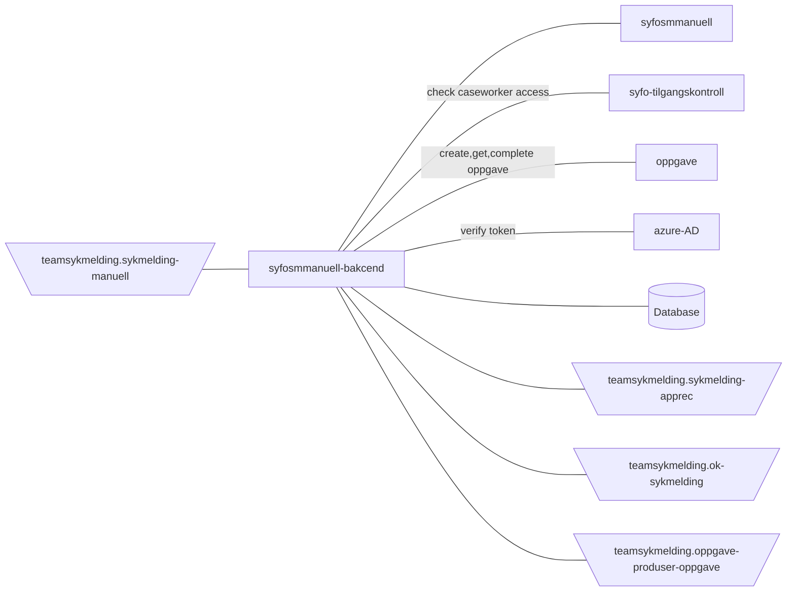

[](https://github.com/navikt/syfosmmanuell-backend/workflows/Deploy%20to%20dev%20and%20prod/badge.svg)

# SYFO Manuell Backend

This project contains the backend for handling manual sykmelding, front end
code: https://github.com/navikt/syfosmmanuell

## Technologies used

* Kotlin
* Ktor
* Gradle
* Kotest
* Jackson
* Postgres
* Docker

## Requirements

* JDK 17
* Docker

## FlowChart
This the high level flow for the application


## Getting started
### Building the application

#### Compile and package application

To build locally and run the integration tests you can simply run
``` bash 
./gradlew shadowJar
 ```
or on windows
`gradlew.bat shadowJar`

#### Creating a docker image

Creating a docker image should be as simple as `docker build -t syfosmmanuell-backend .`

#### Running a docker image

``` bash
docker run --rm -it -p 8080:8080 syfosmmanuell-backend
```

### Access to the Postgres database

For information on connecting to dev og prod database see: [Postgres GCP](https://doc.nais.io/cli/commands/postgres/)

### Upgrading the gradle wrapper

Find the newest version of gradle here: https://gradle.org/releases/ Then run this command:

``` bash
./gradlew wrapper --gradle-version $gradleVersjon
```

### Contact

This project is maintained by [navikt/teamsykmelding](CODEOWNERS)

Questions and/or feature requests? Please create an [issue](https://github.com/navikt/syfosmmanuell-backend/issues)

If you work in [@navikt](https://github.com/navikt) you can reach us at the Slack
channel [#team-sykmelding](https://nav-it.slack.com/archives/CMA3XV997)
